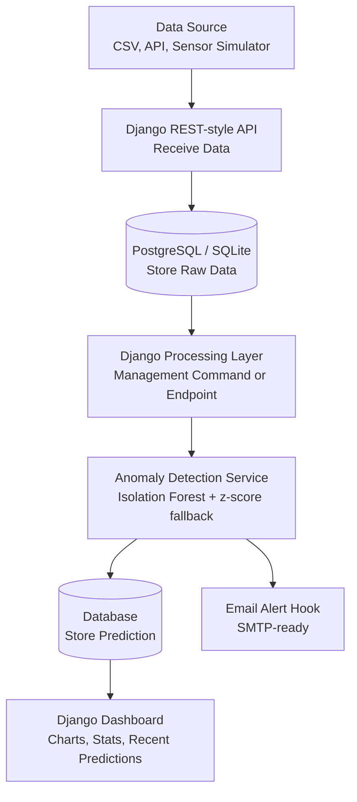

# Serverless Data Anomaly Detector


A full-stack anomaly detection platform I built to ingest sensor readings, store raw data, score anomalies with machine learning, trigger alert hooks, and visualize operational signals on a Django dashboard.

The goal was to keep the system practical: easy to run locally, simple to deploy, and complete enough to show the full data flow from ingestion to prediction.

## Demo Flow

1. Send readings from the API, CSV uploader, or browser simulator.
2. Store raw readings in the database.
3. Score each reading using Isolation Forest with a cold-start z-score fallback.
4. Persist predictions and alert records.
5. Review live metrics, anomaly status, and recent signals on the dashboard.

## Architecture



## What It Does

| Area | Capability |
| --- | --- |
| Ingestion | Single reading API, bulk API, CSV upload, browser simulator |
| Storage | Raw readings, predictions, and alert history |
| ML | Isolation Forest anomaly detection with fallback scoring |
| Dashboard | Totals, metric mix, recent signal chart, prediction table |
| Alerts | Email-ready anomaly alert hook through Django settings |
| Operations | Background-style management command and protected processing endpoint |
| Deployment | Render web service + Neon Postgres friendly config |

## Tech Stack

- **Backend:** Django 4.2
- **Database:** SQLite locally, PostgreSQL in production
- **Machine Learning:** scikit-learn Isolation Forest
- **Frontend:** Django templates, responsive CSS, Chart.js
- **Static Files:** WhiteNoise
- **Deployment:** Render, Neon Postgres, Gunicorn

## Project Structure

```text
.
|-- anomaly_detector/          # Django project settings and URLs
|-- readings/                  # Core app: models, views, services, commands
|-- templates/                 # Dashboard, upload, and simulator pages
|-- static/css/app.css         # Custom responsive UI styling
|-- sample_readings.csv        # CSV upload example
|-- render.yaml                # Render deployment blueprint
|-- Procfile                   # Gunicorn process definition
|-- runtime.txt                # Python runtime for hosting
`-- requirements.txt           # Python dependencies
```

## Local Setup

```bash
python3 -m venv .venv
source .venv/bin/activate
pip install -r requirements.txt
python manage.py migrate
python manage.py generate_sample_data
python manage.py runserver
```

Open:

```text
http://127.0.0.1:8000
```

Useful pages:

| Page | URL |
| --- | --- |
| Dashboard | `http://127.0.0.1:8000/` |
| Sensor Simulator | `http://127.0.0.1:8000/simulator/` |
| CSV Upload | `http://127.0.0.1:8000/upload/` |
| Readings API | `http://127.0.0.1:8000/api/readings/` |

## API Examples

Create one reading:

```bash
curl -X POST http://127.0.0.1:8000/api/readings/ \
  -H "Content-Type: application/json" \
  -d '{"source":"factory-line-a","metric":"temperature","value":91.4,"unit":"F"}'
```

Create multiple readings:

```bash
curl -X POST http://127.0.0.1:8000/api/readings/bulk/ \
  -H "Content-Type: application/json" \
  -d '{
    "readings": [
      {"source":"api","metric":"pressure","value":40.1,"unit":"psi"},
      {"source":"api","metric":"pressure","value":79.8,"unit":"psi"}
    ]
  }'
```

Fetch recent readings:

```bash
curl http://127.0.0.1:8000/api/readings/
```

Process pending readings:

```bash
python manage.py process_pending_readings
```

## CSV Upload Format

Use `sample_readings.csv` as a template.

```csv
source,metric,value,unit
factory-line-a,temperature,72.4,F
factory-line-a,temperature,88.7,F
```

## Environment Variables

Copy `.env.example` when you want local environment-based configuration.

| Variable | Purpose |
| --- | --- |
| `SECRET_KEY` | Django secret key |
| `DEBUG` | `True` locally, `False` in production |
| `DATABASE_URL` | Neon/Postgres connection string for production |
| `ALLOWED_HOSTS` | Comma-separated allowed hostnames |
| `CSRF_TRUSTED_ORIGINS` | Trusted HTTPS origins for deployed app |
| `ALERT_RECIPIENT_EMAIL` | Destination for anomaly alert emails |
| `EMAIL_HOST_USER` | SMTP username |
| `EMAIL_HOST_PASSWORD` | SMTP password |
| `PROCESS_TOKEN` | Token for protected processing endpoint |

## Free Deployment Plan

This project is designed to run on free or low-friction developer platforms.

1. Push the repository to GitHub.
2. Create a free Neon Postgres database.
3. Copy the Neon connection string.
4. Create a Render web service from the GitHub repo.
5. Add `DATABASE_URL` to Render environment variables.
6. Set:

```env
DEBUG=False
ALLOWED_HOSTS=.onrender.com
CSRF_TRUSTED_ORIGINS=https://*.onrender.com
```

7. Deploy using the included `render.yaml`.

Render may sleep free services when idle, which is acceptable for this kind of demo project.

## How Anomaly Detection Works

The detection layer looks at recent readings for the same `source` and `metric`.

- During warmup, it uses a z-score fallback because there is not enough history for model-based scoring.
- Once enough readings exist, it trains an Isolation Forest on the recent value window.
- Each prediction stores a score, model name, anomaly flag, and explanation.
- If an anomaly is found, the alert service creates an alert record and sends an email when SMTP is configured.

## What I Built

- I built an end-to-end anomaly detection pipeline with ingestion, persistence, inference, alerting, and visualization.
- I designed the app to run locally with SQLite and deploy with PostgreSQL.
- I integrated unsupervised ML using Isolation Forest for anomaly scoring.
- I added API ingestion, CSV upload, simulator-based testing, and operational processing commands.
- I included deployment files for Render, Gunicorn, WhiteNoise, and environment-based settings.

## Future Improvements

- Add user authentication and per-user dashboards.
- Add model training history and model version tracking.
- Add SNS, Slack, or webhook alert channels.
- Add Celery or serverless scheduled processing for heavier workloads.
- Add dashboard screenshots after the first hosted deployment.

## License

This project is licensed under the Apache License 2.0 - see the [LICENSE](LICENSE) file for details.
